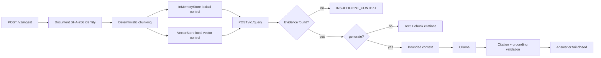
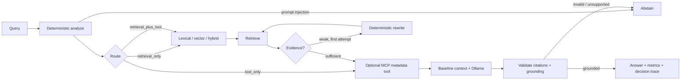
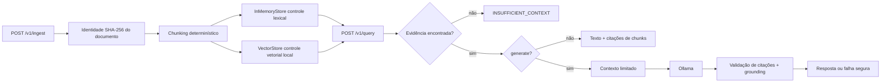
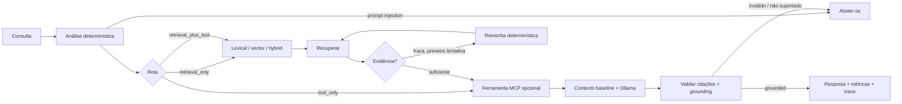

# Production Agentic RAG

A provider-independent reference implementation for building and evaluating a grounded RAG service, from a deliberately small baseline to a bounded LangGraph agent. The repository keeps the baseline path explicit: deterministic ingestion and retrieval, fail-closed evidence handling, local Ollama generation, citation and grounding checks, and an opt-in agentic graph with decision traces.

The project is an engineering reference, not a hosted service or a claim of model superiority. Every result below is tied to checked-in code, datasets, or artifacts.

- **Baseline RAG:** ingestion → deterministic chunking → lexical/vector/hybrid retrieval → bounded context → optional generation → citation/grounding validation.
- **Agentic LangGraph:** deterministic analysis and routing, bounded rewrite/retry, optional in-process MCP metadata lookup, baseline generation, validation, metrics, and node-level decision traces.
- **Local-first:** Ollama at `http://127.0.0.1:11434`, with the configured `qwen2.5:3b` model.
- **MCP boundary:** official Python MCP SDK `mcp==2.3.0`; one allowlisted metadata tool that never returns document content.

## Navigation

- [Quick start](#quick-start)
- [What is implemented](#what-is-implemented)
- [Architecture](#architecture)
- [Baseline vs. agentic](#baseline-vs-agentic)
- [Evidence and benchmarks](#evidence-and-benchmarks)
- [Generation evaluation v1](#generation-evaluation-v1)
- [Security and failure boundaries](#security-and-failure-boundaries)
- [API](#api)
- [Tech stack](#tech-stack)
- [Repository map](#repository-map)
- [Testing and reproducibility](#testing-and-reproducibility)
- [Limitations and roadmap](#limitations-and-roadmap)
- [Português (Brasil)](#português-brasil)

## Quick start

Requirements: Python `>=3.12`. The default API uses in-memory stores. Qdrant is an optional local service for the HTTP adapter and integration coverage.

```bash
python -m pip install -e '.[dev]'
uvicorn agentic_rag.api.app:app --reload
```

In another terminal:

```bash
curl http://localhost:8000/health

curl -X POST http://localhost:8000/v1/ingest \\
  -H 'content-type: application/json' \\
  -d '{"source":"demo","filename":"notes.txt","content":"Qdrant stores vectors."}'

curl -X POST http://localhost:8000/v1/query \\
  -H 'content-type: application/json' \\
  -d '{"query":"where are vectors stored"}'
```

The default query is baseline lexical retrieval with `generate:false`. With evidence, it returns the retrieved text and chunk citations; without evidence, it returns `INSUFFICIENT_CONTEXT` and does not call an LLM.

For local generation, make Ollama available, verify the configured model, and request generation explicitly:

```bash
ollama list
curl -X POST http://localhost:8000/v1/query \\
  -H 'content-type: application/json' \\
  -d '{"query":"Where are vectors stored?","retrieval":"hybrid","generate":true}'
```

The provider uses `num_ctx=2048`, `num_predict=256`, and temperature `0`. No fake or deterministic answer is substituted when Ollama is unavailable or times out.

## What is implemented

### Baseline RAG

- `Document` identity is an immutable SHA-256 checksum of content.
- Chunking is deterministic and preserves document, source, filename, and metadata identity.
- `InMemoryStore` is the lexical M1 control.
- `DeterministicHashEmbedding` plus `VectorStore` is the fixed-dimension local vector control.
- Hybrid retrieval uses explicit reciprocal-rank fusion, `1/(60 + rank)`.
- `DeterministicOverlapReranker` is a transparent local reranking control.
- `QdrantClient` is an optional stdlib-only HTTP adapter; it does not silently fall back.
- The response exposes retrieval, generation, grounding, latency, citations, and `trace_id` fields.

### Agentic LangGraph

Agentic mode is enabled with `"mode":"agentic"` on `POST /v1/query`; baseline remains the default when the field is omitted. The graph is typed and bounded:

1. **Analyze:** normalize the query, detect prompt-injection patterns, and choose lexical, vector, or hybrid retrieval using deterministic rules.
2. **Route:** select `retrieval_only`, `tool_only`, or `retrieval_plus_tool` when a document identifier and metadata/source intent are present.
3. **Retrieve:** reuse the existing stores and retrieval service.
4. **Evaluate:** score available evidence.
5. **Rewrite:** perform at most one retry within a two-attempt graph limit.
6. **Generate:** reuse the baseline context builder and Ollama provider.
7. **Validate or abstain:** check grounding and citations, then return an answer or a fail-closed status.

The agentic response adds `metrics` and `decision_trace`. Traces contain node names, attempts, selected strategy, evidence scores, route details, rewrites, tool status, validation, and errors where applicable. Prompts and raw provider internals are not returned.

### In-process MCP metadata tool

The repository uses the official Python MCP SDK `mcp==2.3.0`. The standalone server is `agentic_rag.mcp.server`; its only exposed tool is `get_document_metadata(document_id)`. It is backed by the existing `InMemoryStore`, returns allowlisted document metadata, and never returns document content.

`MCPToolClient` is a fail-closed policy boundary: exact argument validation, an allowlist, a maximum of two calls, a timeout, and explicit `MCPToolError` failures. Tool output is untrusted data and is not added to the generation prompt. The graph accepts an optional `MCPToolClient`; the default API graph does not silently enable a tool client, so tool routes require explicit wiring.

## Architecture

### Baseline pipeline



The API supports `lexical` (default), `vector`, `hybrid`, and `hybrid+reranking`. Qdrant is separate from these default in-memory controls and is probed at `/v1/retrieval/qdrant-health`; unavailable Qdrant returns HTTP `503`.

### Agentic pipeline



The graph never treats retrieved documents or metadata as instructions. The rewrite is deterministic, not an LLM planning loop; generation is the only graph node that calls the configured provider.

## Baseline vs. agentic

| Concern | Baseline | Agentic LangGraph |
|---|---|---|
| Default | Yes | Opt-in with `mode=agentic` |
| Query analysis | Direct request parameters | Deterministic normalization, risk detection, and strategy selection |
| Retrieval | Lexical, vector, hybrid, hybrid+reranking | Reuses the same retrieval components |
| Retry | None in the baseline endpoint | One deterministic rewrite, maximum two retrieval attempts |
| MCP | Not used | Optional in-process metadata boundary |
| Generation | Optional Ollama call | Reuses the baseline generation service |
| Safety result | `INSUFFICIENT_CONTEXT` or provider error | Abstention, provider/MCP error, or validated answer |
| Observability | `trace_id`, latency, retrieval/generation/grounding fields | Adds node-level `decision_trace` and `metrics` |
| Claim supported by this repository | Stable compatibility control | Bounded routing and trace behavior, not autonomous general planning |

## Evidence and benchmarks

### Retrieval benchmark

The checked-in M2A.1-R2 artifact uses the frozen 40-case dataset `datasets/m2a-retrieval-v2.json`, `sentence-transformers/all-MiniLM-L6-v2`, CPU, 384 dimensions, cosine distance, five measured runs plus one warmup, candidate `k=10`, final `k=5`, and RRF `k=60`.

For the hybrid semantic RRF strategy, the artifact reports:

| Metric | Global result |
|---|---:|
| Hit rate | 0.900 |
| Recall | 0.891667 |
| MRR | 0.833333 |
| nDCG | 0.836357 |
| Mean latency | 15.449804 ms |
| p50 / p95 latency | 13.250434 / 26.370232 ms |

The hybrid semantic RRF with deterministic-overlap reranking result is also recorded in `artifacts/benchmarks/latest.json`; these are local benchmark measurements, not production capacity estimates. Negative queries are explicitly measured and have zero hit rate in the artifact. The benchmark is evidence for this frozen dataset and configuration, not a general semantic-quality claim.

The older eight-case offline control remains reproducible through `datasets/m2a-retrieval-v1.json` and `make benchmark-retrieval`; the artifact records commit, dataset, provider, configuration, timing, and metrics.

## Generation evaluation v1

`datasets/generation-eval-v1.json` contains four cases: two answerable and two unanswerable. The checked-in real-provider artifact compares `hybrid+llm` and `vector-semantic+llm` using Ollama model `aratan/Agents-A1-4B-Q4_K_M-GGUF:Q4_K_M`.

| Strategy | Answer correctness | Groundedness | Citation correctness | Abstention correctness | Mean total latency |
|---|---:|---:|---:|---:|---:|
| Hybrid + LLM | 0.25 | 0.50 | 1.00 | 1.00 | 28,670.68 ms |
| Vector Semantic + LLM | 0.25 | 0.50 | 1.00 | 1.00 | 29,598.93 ms |

The run completed all four cases for both strategies. It is pipeline validation, not a statistically meaningful benchmark: four cases cannot establish superiority, Ollama output is model-dependent, lexical grounding is a practical signal rather than proof, and the semantic challenger requires the optional CPU sentence-transformers environment.

Reproduce the historical v1 evaluation with:

```bash
PYTHONPATH=src .venv-semantic-cpu/bin/python scripts/run_generation_evaluation.py
```

### Generation evaluation v2: Baseline RAG vs Agentic RAG

The final 30-case evaluation is frozen in `datasets/generation-eval-v2.json` (direct, paraphrase, ambiguous, multi-chunk, terminology, insufficient-context, metadata/tool, retrieval+MCP, and indirect-injection cases). It uses the same corpus and cases for both arms, deterministic fact/source/abstention scoring, and SHA-256 corpus `055d5a170e0b9862fd842c914558c3c2d3d204d31c96e2e935435a85a75bd885`. Both arms use Ollama `qwen2.5:3b`, timeout 120s, `num_ctx=2048`, `num_predict=256`, temperature `0`, and `think=false`; no LLM judge is used.

| Strategy | Quality | Fact recall | Source precision / recall | Abstention accuracy | Mean latency | LLM calls | MCP calls |
|---|---:|---:|---:|---:|---:|---:|---:|
| Baseline (n=30) | 0.208333 | 0.250000 | 0.200000 / 0.200000 | 0.266667 | 8,286.843 ms | 30 | 0 |
| Agentic (n=30) | 0.238333 | 0.310000 | 0.200000 / 0.200000 | 0.233333 | 7,921.985 ms | 26 | 4 |

Agentic routing selected lexical 19 times, vector 4 times, and hybrid 7 times. Its retry and rewrite percentages were both 0% in this bounded run (`max_attempts=1` for the final comparable arm); MCP was used in 13.333% of cases. No provider errors occurred. The agentic arm improved fact recall by 0.060000 and quality by 0.030000, while abstention accuracy was 0.033334 lower. These results are corpus- and model-specific: they show bounded routing/tool behavior, not general model or strategy superiority. Generation is CPU-bound and the answer quality remains limited by retrieval and model citation behavior.

Run it with:

```bash
PYTHONPATH=src .venv-semantic-cpu/bin/python scripts/run_baseline_vs_agentic_evaluation.py
```

The complete per-case, aggregate, category, latency, attempt/rewrite/call, strategy, and error record is checked in at `artifacts/benchmarks/baseline-vs-agentic-v2.json`.

## Security and failure boundaries

- Retrieved documents and MCP metadata are untrusted data; they are not instructions, executable content, graph control, or retrieval policy.
- The grounded prompt separates evidence from instructions. Prompt-injection patterns are detected deterministically in agentic analysis and cause abstention.
- The MCP client exposes only `get_document_metadata`, validates arguments, limits calls to two, applies a timeout, and fails closed on transport, tool, or output errors.
- Metadata is not inserted into the generation context. Source answers retain chunk citations and may add identifiable tool provenance when the optional client is wired.
- Missing evidence produces `INSUFFICIENT_CONTEXT`; unsupported citations and unsupported grounding do not become confident answers.
- Ollama timeout, unavailable-provider, and provider failures are explicit errors; no fake fallback answer is used.
- Document content is identified by SHA-256, but the default stores are in-memory and are not an access-control system. No credentials, authentication, authorization, or secrets-management layer is implemented.

## API

### `POST /v1/ingest`

Request schema:

```json
{
  "source": "demo",
  "filename": "notes.txt",
  "mime_type": "text/plain",
  "content": "Qdrant stores vectors.",
  "metadata": {"topic": "storage"}
}
```

`source`, `filename`, and `content` are required; `mime_type` defaults to `text/plain`, and `metadata` defaults to `{}`. Response is:

```json
{"document_id":"<sha256>","duplicate":false,"chunks":1}
```

Duplicate content returns the same `document_id`, `duplicate:true`, and `chunks:0`.

### `POST /v1/query`

Request schema:

```json
{
  "query": "Where are vectors stored?",
  "limit": 5,
  "retrieval": "hybrid",
  "metadata_filter": null,
  "generate": true,
  "mode": "baseline",
  "context_tokens": 1800
}
```

`query` is required. `limit` is `1..50`; `retrieval` is `lexical`, `vector`, `hybrid`, or `hybrid+reranking`; `generate` defaults to `false`; `mode` is `baseline` or `agentic`; and `context_tokens` is `1..12000`, defaulting to `1800`. A baseline response includes `status`, `answer`, `citations`, `retrieval`, `generation`, `grounding`, `latency`, `trace_id`, `grounded`, and `retrieved_chunks`. Agentic responses additionally include `metrics` and `decision_trace`.

Operational endpoints are `GET /health`, `GET /ready`, `GET /version`, and `GET /v1/retrieval/qdrant-health`.

## Tech stack

- Python `>=3.12`, FastAPI, Uvicorn, Pydantic 2
- LangGraph `>=0.6,<1` for the bounded typed graph
- Official MCP Python SDK `mcp>=2.3,<3` (the checked-in environment uses `2.3.0`)
- Ollama local HTTP provider
- In-memory lexical/vector controls and optional Qdrant `qdrant/qdrant:v1.12.5`
- Optional `sentence-transformers>=3.0,<4`, with `all-MiniLM-L6-v2` for the semantic artifact
- Pytest and Ruff

## Repository map

```text
.
├── src/agentic_rag/
│   ├── agentic/graph.py          # bounded LangGraph orchestration
│   ├── api/app.py                # FastAPI schemas and endpoints
│   ├── generation/               # Ollama provider, context, grounding
│   ├── mcp/                      # MCP SDK server and policy client
│   ├── retrieval/                # lexical, vector, hybrid, reranking, Qdrant
│   ├── chunking/                 # deterministic chunking
│   └── storage/                  # documents, chunks, in-memory store
├── datasets/
│   ├── generation-eval-v1.json
│   ├── m2a-retrieval-v1.json
│   └── m2a-retrieval-v2.json
├── artifacts/benchmarks/         # checked-in benchmark evidence
├── docs/                         # architecture, API-adjacent design notes, evaluations
├── scripts/                      # benchmark and generation evaluation runners
├── tests/unit/                   # baseline, retrieval, agentic, MCP tests
├── tests/integration/qdrant/     # live Qdrant lifecycle coverage
├── Makefile
├── docker-compose.yml
└── pyproject.toml
```

## Testing and reproducibility

The repository's local gates are:

```bash
python -m pytest -q
ruff check src tests scripts
```

Useful existing Make targets:

```bash
make setup
make test
make lint
make evaluate-retrieval
make benchmark-retrieval
make benchmark-semantic
make test-integration
make up
make down
```

`make test-integration` requires the Qdrant service. `make benchmark-semantic` requires the optional semantic dependencies and model environment. Focused MCP/agentic coverage is:

```bash
pytest -q tests/unit/test_mcp.py tests/unit/test_agentic.py
```

The checked-in artifacts preserve dataset paths, checksums, model/provider metadata, configuration, timing, and selected environment facts. Re-running a live Ollama or semantic benchmark can vary with hardware, model availability, dependency versions, and local service state.

## Limitations and roadmap

Current limitations are intentional: default retrieval uses deterministic hash vectors rather than a learned encoder; semantic evaluation is optional and CPU-oriented; stores are in-memory; Qdrant is an optional adapter; Ollama output is model-dependent; grounding is lexical evidence checking; and there is no authentication, authorization, persistence layer, memory, deployment platform, observability backend, commercial provider, or statistical generation benchmark. The default API graph also requires explicit MCP client wiring for tool calls.

Roadmap direction is to preserve the baseline control while adding evidence-backed improvements: broader evaluation datasets, stronger retrieval and grounding evaluations, explicit persistence and operational observability, and carefully bounded integrations. The repository does not claim those future capabilities today.

---

# Português (Brasil)

Uma implementação de referência, independente de provedor, para construir e avaliar um serviço RAG fundamentado, partindo de um baseline pequeno até um agente LangGraph limitado por regras claras. O repositório mantém explícito o caminho baseline: ingestão e recuperação determinísticas, tratamento de evidência com falha segura, geração local via Ollama, validação de citações e grounding, além de um grafo agentic opcional com rastros de decisão.

O projeto é uma referência de engenharia, não um serviço hospedado nem uma alegação de superioridade de modelo. Cada resultado abaixo está ligado ao código, aos datasets ou aos artefatos versionados.

- **Baseline RAG:** ingestão → chunking determinístico → recuperação lexical/vetorial/híbrida → contexto limitado → geração opcional → validação de citações/grounding.
- **LangGraph agentic:** análise e roteamento determinísticos, reescrita/repetição limitada, consulta opcional a metadados via MCP em processo, geração baseline, validação, métricas e rastros de decisão por nó.
- **Local-first:** Ollama em `http://127.0.0.1:11434`, com o modelo configurado `qwen2.5:3b`.
- **Limite MCP:** SDK Python oficial `mcp==2.3.0`; uma ferramenta permitida de metadados que nunca retorna o conteúdo dos documentos.

## Navegação

- [Início rápido](#início-rápido)
- [O que está implementado](#o-que-está-implementado)
- [Arquitetura](#arquitetura-1)
- [Baseline vs. agentic](#baseline-vs-agentic-1)
- [Evidências e benchmarks](#evidências-e-benchmarks)
- [Avaliação de geração v1](#avaliação-de-geração-v1)
- [Limites de segurança e falha](#limites-de-segurança-e-falha)
- [API](#api-1)
- [Stack técnico](#stack-técnico)
- [Mapa do repositório](#mapa-do-repositório)
- [Testes e reprodutibilidade](#testes-e-reprodutibilidade)
- [Limitações e roadmap](#limitações-e-roadmap)
- [English](#production-agentic-rag)

## Início rápido

Requisito: Python `>=3.12`. A API padrão usa armazenamentos em memória. Qdrant é um serviço local opcional para o adaptador HTTP e os testes de integração.

```bash
python -m pip install -e '.[dev]'
uvicorn agentic_rag.api.app:app --reload
```

Em outro terminal:

```bash
curl http://localhost:8000/health

curl -X POST http://localhost:8000/v1/ingest \\
  -H 'content-type: application/json' \\
  -d '{"source":"demo","filename":"notes.txt","content":"Qdrant stores vectors."}'

curl -X POST http://localhost:8000/v1/query \\
  -H 'content-type: application/json' \\
  -d '{"query":"where are vectors stored"}'
```

A consulta padrão usa recuperação lexical baseline com `generate:false`. Com evidência, retorna o texto recuperado e citações dos chunks; sem evidência, retorna `INSUFFICIENT_CONTEXT` e não chama um LLM.

Para geração local, disponibilize o Ollama, verifique o modelo configurado e peça geração explicitamente:

```bash
ollama list
curl -X POST http://localhost:8000/v1/query \\
  -H 'content-type: application/json' \\
  -d '{"query":"Where are vectors stored?","retrieval":"hybrid","generate":true}'
```

O provedor usa `num_ctx=2048`, `num_predict=256` e temperatura `0`. Quando o Ollama está indisponível ou expira, nenhuma resposta falsa ou determinística é usada como substituição.

## O que está implementado

### Baseline RAG

- A identidade de `Document` é um checksum SHA-256 imutável do conteúdo.
- O chunking é determinístico e preserva a identidade do documento, source, filename e metadados.
- `InMemoryStore` é o controle lexical M1.
- `DeterministicHashEmbedding` com `VectorStore` é o controle vetorial local de dimensão fixa.
- A recuperação híbrida usa fusão explícita de ranking recíproco, `1/(60 + rank)`.
- `DeterministicOverlapReranker` é um controle de reranking local e transparente.
- `QdrantClient` é um adaptador HTTP opcional, usando apenas a biblioteca padrão; ele não faz fallback silencioso.
- A resposta expõe campos de recuperação, geração, grounding, latência, citações e `trace_id`.

### LangGraph agentic

O modo agentic é ativado com `"mode":"agentic"` em `POST /v1/query`; sem esse campo, o baseline continua sendo o padrão. O grafo é tipado e limitado:

1. **Analisar:** normalizar a consulta, detectar padrões de prompt injection e escolher lexical, vector ou hybrid por regras determinísticas.
2. **Roteirizar:** selecionar `retrieval_only`, `tool_only` ou `retrieval_plus_tool` quando houver identificador de documento e intenção de metadados/source.
3. **Recuperar:** reutilizar os stores e o serviço de recuperação existentes.
4. **Avaliar:** pontuar a evidência disponível.
5. **Reescrever:** fazer no máximo uma nova tentativa, dentro do limite de duas tentativas do grafo.
6. **Gerar:** reutilizar o context builder baseline e o provedor Ollama.
7. **Validar ou abster-se:** verificar grounding e citações e retornar resposta ou status de falha segura.

A resposta agentic adiciona `metrics` e `decision_trace`. Os rastros contêm nomes dos nós, tentativas, estratégia escolhida, pontuações de evidência, roteamento, reescritas, status da ferramenta, validação e erros quando aplicável. Prompts e detalhes internos brutos do provedor não são retornados.

### Ferramenta MCP de metadados em processo

O repositório usa o SDK Python oficial MCP `mcp==2.3.0`. O servidor standalone é `agentic_rag.mcp.server`; sua única ferramenta exposta é `get_document_metadata(document_id)`. Ela usa o `InMemoryStore` existente, retorna apenas metadados permitidos e nunca retorna conteúdo de documento.

`MCPToolClient` é um limite de política com falha segura: validação exata dos argumentos, allowlist, máximo de duas chamadas, timeout e erros `MCPToolError` explícitos. A saída da ferramenta é dado não confiável e não entra no prompt de geração. O grafo aceita um `MCPToolClient` opcional; o grafo padrão da API não ativa um cliente de ferramenta silenciosamente, portanto as rotas de ferramenta exigem wiring explícito.

## Arquitetura

### Pipeline baseline



A API aceita `lexical` (padrão), `vector`, `hybrid` e `hybrid+reranking`. Qdrant é separado dos controles padrão em memória e é verificado em `/v1/retrieval/qdrant-health`; quando indisponível, Qdrant retorna HTTP `503`.

### Pipeline agentic



O grafo nunca trata documentos recuperados ou metadados como instruções. A reescrita é determinística, não um loop de planejamento por LLM; geração é o único nó do grafo que chama o provedor configurado.

## Baseline vs. agentic

| Aspecto | Baseline | LangGraph agentic |
|---|---|---|
| Padrão | Sim | Opt-in com `mode=agentic` |
| Análise de consulta | Parâmetros diretos da requisição | Normalização determinística, detecção de risco e escolha de estratégia |
| Recuperação | Lexical, vector, hybrid, hybrid+reranking | Reutiliza os mesmos componentes |
| Repetição | Nenhuma no endpoint baseline | Uma reescrita determinística, no máximo duas tentativas |
| MCP | Não usado | Limite opcional de metadados em processo |
| Geração | Chamada Ollama opcional | Reutiliza o serviço de geração baseline |
| Resultado seguro | `INSUFFICIENT_CONTEXT` ou erro do provedor | Abstenção, erro de provedor/MCP ou resposta validada |
| Observabilidade | `trace_id`, latência, campos de retrieval/generation/grounding | Adiciona `decision_trace` por nó e `metrics` |
| Afirmação sustentada pelo repositório | Controle de compatibilidade estável | Roteamento limitado e comportamento rastreável, não planejamento autônomo geral |

## Evidências e benchmarks

### Benchmark de recuperação

O artefato M2A.1-R2 versionado usa o dataset congelado de 40 casos `datasets/m2a-retrieval-v2.json`, `sentence-transformers/all-MiniLM-L6-v2`, CPU, 384 dimensões, distância cosseno, cinco execuções medidas mais uma de aquecimento, candidate `k=10`, final `k=5` e RRF `k=60`.

Para a estratégia hybrid semantic RRF, o artefato registra:

| Métrica | Resultado global |
|---|---:|
| Hit rate | 0.900 |
| Recall | 0.891667 |
| MRR | 0.833333 |
| nDCG | 0.836357 |
| Latência média | 15.449804 ms |
| Latência p50 / p95 | 13.250434 / 26.370232 ms |

O resultado hybrid semantic RRF com reranking deterministic-overlap também está em `artifacts/benchmarks/latest.json`; são medições locais, não estimativas de capacidade de produção. Consultas negativas são medidas explicitamente e têm hit rate zero no artefato. O benchmark é evidência para esse dataset e configuração congelados, não uma alegação geral de qualidade semântica.

O controle offline anterior de oito casos continua reproduzível por `datasets/m2a-retrieval-v1.json` e `make benchmark-retrieval`; o artefato registra commit, dataset, provedor, configuração, tempos e métricas.

## Avaliação de geração v1

`datasets/generation-eval-v1.json` contém quatro casos: dois respondíveis e dois não respondíveis. O artefato real versionado compara `hybrid+llm` e `vector-semantic+llm` usando o modelo Ollama `aratan/Agents-A1-4B-Q4_K_M-GGUF:Q4_K_M`.

| Estratégia | Answer correctness | Groundedness | Citation correctness | Abstention correctness | Latência total média |
|---|---:|---:|---:|---:|---:|
| Hybrid + LLM | 0.25 | 0.50 | 1.00 | 1.00 | 28.670,68 ms |
| Vector Semantic + LLM | 0.25 | 0.50 | 1.00 | 1.00 | 29.598,93 ms |

A execução completou os quatro casos nas duas estratégias. É validação do pipeline, não benchmark estatisticamente significativo: quatro casos não estabelecem superioridade, a saída do Ollama depende do modelo, grounding lexical é um sinal prático e não uma prova, e o desafiante semântico requer o ambiente CPU opcional de sentence-transformers.

Reproduza a avaliação histórica v1 com:

```bash
PYTHONPATH=src .venv-semantic-cpu/bin/python scripts/run_generation_evaluation.py
```

### Avaliação de geração v2: Baseline RAG vs Agentic RAG

A avaliação final de 30 casos está congelada em `datasets/generation-eval-v2.json` (casos diretos, paráfrases, ambíguos, multi-chunk, terminologia, contexto insuficiente, metadata/tool, retrieval+MCP e injeção indireta). Os dois braços usam o mesmo corpus e casos, pontuação determinística de fatos/fontes/abstenção e SHA-256 do corpus `055d5a170e0b9862fd842c914558c3c2d3d204d31c96e2e935435a85a75bd885`. Ambos usam Ollama `qwen2.5:3b`, timeout de 120s, `num_ctx=2048`, `num_predict=256`, temperatura `0` e `think=false`; não há juiz LLM único.

| Estratégia | Qualidade | Recall de fatos | Precisão / recall de fonte | Precisão de abstenção | Latência média | Chamadas LLM | Chamadas MCP |
|---|---:|---:|---:|---:|---:|---:|---:|
| Baseline (n=30) | 0.208333 | 0.250000 | 0.200000 / 0.200000 | 0.266667 | 8.286,843 ms | 30 | 0 |
| Agentic (n=30) | 0.238333 | 0.310000 | 0.200000 / 0.200000 | 0.233333 | 7.921,985 ms | 26 | 4 |

O roteamento agentic selecionou lexical 19 vezes, vector 4 vezes e hybrid 7 vezes. Os percentuais de retry e rewrite foram ambos 0% nesta execução limitada (`max_attempts=1` no braço comparável final); MCP foi usado em 13,333% dos casos. Não ocorreram erros do provedor. O braço agentic aumentou o recall de fatos em 0.060000 e a qualidade em 0.030000, mas teve precisão de abstenção 0.033334 menor. Os resultados são específicos do corpus e modelo: demonstram roteamento e ferramenta limitados, não superioridade geral. A geração é limitada pela CPU, pela recuperação e pelo comportamento de citações do modelo.

Execute com:

```bash
PYTHONPATH=src .venv-semantic-cpu/bin/python scripts/run_baseline_vs_agentic_evaluation.py
```

O registro completo por caso, agregado, por categoria, latência, tentativas/rewrite/chamadas, estratégia e erros está em `artifacts/benchmarks/baseline-vs-agentic-v2.json`.

## Limites de segurança e falha

- Documentos recuperados e metadados MCP são dados não confiáveis; não são instruções, código executável, controle do grafo ou política de recuperação.
- O prompt grounded separa evidência de instruções. Padrões de prompt injection são detectados deterministicamente no modo agentic e causam abstenção.
- O cliente MCP expõe apenas `get_document_metadata`, valida argumentos, limita chamadas a duas, aplica timeout e falha com segurança em erros de transporte, ferramenta ou saída.
- Metadados não entram no contexto de geração. Respostas sobre source mantêm citações de chunks e podem adicionar provenance identificável da ferramenta quando o cliente opcional está conectado.
- Ausência de evidência produz `INSUFFICIENT_CONTEXT`; citações não suportadas e grounding não suportado não viram respostas confiantes.
- Timeout, indisponibilidade e falhas do Ollama são erros explícitos; não há resposta fake de fallback.
- O conteúdo é identificado por SHA-256, mas os stores padrão são em memória e não constituem controle de acesso. Não há camada de credenciais, autenticação, autorização ou gestão de segredos.

## API

### `POST /v1/ingest`

Schema da requisição:

```json
{
  "source": "demo",
  "filename": "notes.txt",
  "mime_type": "text/plain",
  "content": "Qdrant stores vectors.",
  "metadata": {"topic": "storage"}
}
```

`source`, `filename` e `content` são obrigatórios; `mime_type` tem default `text/plain` e `metadata` tem default `{}`. A resposta é:

```json
{"document_id":"<sha256>","duplicate":false,"chunks":1}
```

Conteúdo duplicado retorna o mesmo `document_id`, `duplicate:true` e `chunks:0`.

### `POST /v1/query`

Schema da requisição:

```json
{
  "query": "Where are vectors stored?",
  "limit": 5,
  "retrieval": "hybrid",
  "metadata_filter": null,
  "generate": true,
  "mode": "baseline",
  "context_tokens": 1800
}
```

`query` é obrigatório. `limit` é `1..50`; `retrieval` aceita `lexical`, `vector`, `hybrid` ou `hybrid+reranking`; `generate` tem default `false`; `mode` aceita `baseline` ou `agentic`; e `context_tokens` é `1..12000`, com default `1800`. Uma resposta baseline inclui `status`, `answer`, `citations`, `retrieval`, `generation`, `grounding`, `latency`, `trace_id`, `grounded` e `retrieved_chunks`. Respostas agentic incluem também `metrics` e `decision_trace`.

Os endpoints operacionais são `GET /health`, `GET /ready`, `GET /version` e `GET /v1/retrieval/qdrant-health`.

## Stack técnico

- Python `>=3.12`, FastAPI, Uvicorn, Pydantic 2
- LangGraph `>=0.6,<1` para o grafo tipado e limitado
- SDK Python oficial MCP `mcp>=2.3,<3` (o ambiente versionado usa `2.3.0`)
- Provedor HTTP local Ollama
- Controles lexicais/vetoriais em memória e Qdrant opcional `qdrant/qdrant:v1.12.5`
- `sentence-transformers>=3.0,<4` opcional, com `all-MiniLM-L6-v2` para o artefato semântico
- Pytest e Ruff

## Mapa do repositório

```text
.
├── src/agentic_rag/
│   ├── agentic/graph.py          # orquestração LangGraph limitada
│   ├── api/app.py                # schemas e endpoints FastAPI
│   ├── generation/               # provedor Ollama, contexto, grounding
│   ├── mcp/                      # servidor SDK MCP e cliente de política
│   ├── retrieval/                # lexical, vector, hybrid, reranking, Qdrant
│   ├── chunking/                 # chunking determinístico
│   └── storage/                  # documentos, chunks, store em memória
├── datasets/
│   ├── generation-eval-v1.json
│   ├── m2a-retrieval-v1.json
│   └── m2a-retrieval-v2.json
├── artifacts/benchmarks/         # evidências de benchmark versionadas
├── docs/                         # arquitetura, decisões e avaliações
├── scripts/                      # executores de benchmark e avaliação de geração
├── tests/unit/                   # testes baseline, retrieval, agentic e MCP
├── tests/integration/qdrant/     # cobertura do ciclo de vida Qdrant
├── Makefile
├── docker-compose.yml
└── pyproject.toml
```

## Testes e reprodutibilidade

Os gates locais do repositório são:

```bash
python -m pytest -q
ruff check src tests scripts
```

Targets Make existentes:

```bash
make setup
make test
make lint
make evaluate-retrieval
make benchmark-retrieval
make benchmark-semantic
make test-integration
make up
make down
```

`make test-integration` exige o serviço Qdrant. `make benchmark-semantic` exige as dependências semânticas opcionais e o ambiente do modelo. A cobertura focada de MCP/agentic é:

```bash
pytest -q tests/unit/test_mcp.py tests/unit/test_agentic.py
```

Os artefatos versionados preservam caminhos e checksums dos datasets, metadados de modelo/provedor, configuração, tempos e fatos selecionados do ambiente. Uma nova execução do Ollama ou do benchmark semântico pode variar conforme hardware, disponibilidade do modelo, versões das dependências e estado dos serviços locais.

## Limitações e roadmap

As limitações atuais são intencionais: a recuperação padrão usa vetores hash determinísticos em vez de encoder aprendido; a avaliação semântica é opcional e orientada a CPU; os stores são em memória; Qdrant é um adaptador opcional; a saída do Ollama depende do modelo; grounding é verificação lexical de evidência; e não há autenticação, autorização, persistência, memória, plataforma de deploy, backend de observabilidade, provedor comercial ou benchmark estatístico de geração. O grafo padrão da API também exige wiring explícito do cliente MCP para chamadas de ferramenta.

A direção do roadmap é preservar o controle baseline enquanto adiciona melhorias apoiadas por evidência: datasets de avaliação mais amplos, avaliações mais fortes de recuperação e grounding, persistência e observabilidade operacionais explícitas e integrações cuidadosamente limitadas. O repositório não afirma possuir essas capacidades futuras hoje.
