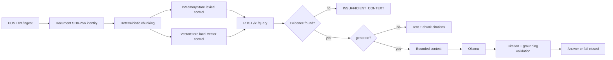
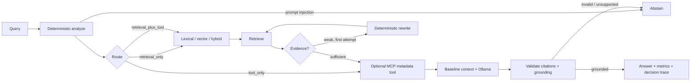

# Production Agentic RAG

**A practical reference implementation for building and evaluating AI applications that answer questions using retrieved information.**

[Português (Brasil)](README.pt-BR.md) · [Technical documentation](docs/TECHNICAL.md) · [Repository](https://github.com/hectordufau/productionagentrag) · [v1.0.0 release](https://github.com/hectordufau/productionagentrag/releases/tag/v1.0.0)

## Why this project exists

LLMs can produce convincing answers without having the information needed to support them. Retrieval-augmented generation (RAG) addresses that problem by retrieving evidence before generation. This project asks a practical question: **does adding an agent make a RAG system better?**

It keeps a predictable Baseline RAG beside a bounded Agentic RAG so the difference can be measured rather than assumed. The repository reports both gains and regressions.

## How it works

For a question such as *Where are vectors stored?*, the system ingests documents, retrieves relevant chunks, builds a bounded context, optionally generates a local Ollama answer, and validates grounding and citations. When evidence is insufficient, it returns `INSUFFICIENT_CONTEXT` instead of guessing.

Agentic mode adds controlled strategy selection, evidence evaluation, at most one conservative rewrite within a two-attempt limit, and optional MCP metadata lookup. It is a bounded decision workflow, not unrestricted autonomous planning.

## Main capabilities

| Capability | What it does |
|---|---|
| Lexical retrieval | Finds chunks using matching words. |
| Semantic retrieval | Finds chunks by meaning with `all-MiniLM-L6-v2`. |
| Hybrid retrieval | Combines lexical and vector rankings with RRF. |
| Reranking | Reorders candidates with a transparent local reranker. |
| LangGraph | Orchestrates bounded Agentic RAG decisions. |
| MCP | Exposes an allowlisted document-metadata tool. |
| Ollama | Runs the grounded LLM locally with `qwen2.5:3b`. |
| Qdrant | Provides optional persistent vector storage. |
| Grounding and citations | Checks that answers are supported by submitted chunks. |
| Evaluation | Compares Baseline and Agentic behavior on frozen datasets. |
| Observability | Records traces, decisions, attempts, latency, and tool calls. |

## Navigation

- [Quick start](#quick-start)
- [What is implemented](#what-is-implemented)
- [Architecture](#architecture)
- [Baseline vs. agentic](#baseline-vs-agentic)
- [Evidence and benchmarks](#evidence-and-benchmarks)
- [Generation evaluation v1](#generation-evaluation-v1)
- [Security and failure boundaries](#security-and-failure-boundaries)
- [API](#api)
- [Tech stack](#tech-stack)
- [Repository map](#repository-map)
- [Testing and reproducibility](#testing-and-reproducibility)
- [Limitations and roadmap](#limitations-and-roadmap)
- [Português (Brasil)](README.pt-BR.md)
- [Technical documentation](docs/TECHNICAL.md)

## Quick start

Requirements: Python `>=3.12`. The default API uses the explicit deterministic/in-memory control (`RETRIEVAL_BACKEND=memory`, `EMBEDDING_PROVIDER=deterministic`). Production wiring is opt-in: `RETRIEVAL_BACKEND=qdrant` with `EMBEDDING_PROVIDER=sentence-transformers` uses persistent Qdrant and `all-MiniLM-L6-v2` (384 dimensions).

```bash
python -m pip install -e '.[dev]'
uvicorn agentic_rag.api.app:app --reload
```

In another terminal:

```bash
curl http://localhost:8000/health

curl -X POST http://localhost:8000/v1/ingest \\
  -H 'content-type: application/json' \\
  -d '{"source":"demo","filename":"notes.txt","content":"Qdrant stores vectors."}'

curl -X POST http://localhost:8000/v1/query \\
  -H 'content-type: application/json' \\
  -d '{"query":"where are vectors stored"}'
```

The default query is baseline lexical retrieval with `generate:false`. With evidence, it returns the retrieved text and chunk citations; without evidence, it returns `INSUFFICIENT_CONTEXT` and does not call an LLM.

For local generation, pull the verified default model, make Ollama available, and request generation explicitly:

```bash
ollama pull qwen2.5:3b
ollama list
curl -X POST http://localhost:8000/v1/query \\
  -H 'content-type: application/json' \\
  -d '{"query":"Where are vectors stored?","retrieval":"hybrid","generate":true}'
```

The application default is verified in `src/agentic_rag/api/app.py` as `qwen2.5:3b` and `http://127.0.0.1:11434`. Ollama requests explicitly set `num_ctx=2048`, `num_predict=256`, temperature `0`, and `think=false`. Override with `OLLAMA_MODEL`/`OLLAMA_URL`; no fake answer is substituted when Ollama is unavailable.

Production-style Compose configuration (persistent Qdrant volume; deterministic control remains explicit):

```bash
RETRIEVAL_BACKEND=qdrant EMBEDDING_PROVIDER=sentence-transformers docker compose up --build
```

Useful environment variables are `RETRIEVAL_BACKEND`, `EMBEDDING_PROVIDER`, `EMBEDDING_MODEL`, `QDRANT_URL`, `QDRANT_COLLECTION`, `OLLAMA_URL`, `OLLAMA_MODEL`, and `MCP_ENABLED`. `/ready` checks Qdrant when the Qdrant backend is selected.

## What is implemented

### Baseline RAG

- `Document` identity is an immutable SHA-256 checksum of content.
- Chunking is deterministic and preserves document, source, filename, and metadata identity.
- `InMemoryStore` is the lexical M1 control.
- `DeterministicHashEmbedding` plus `VectorStore` is the fixed-dimension local vector control.
- Hybrid retrieval uses explicit reciprocal-rank fusion, `1/(60 + rank)`.
- `DeterministicOverlapReranker` is a transparent local reranking control.
- `QdrantClient` is an optional stdlib-only HTTP adapter; it does not silently fall back.
- The response exposes retrieval, generation, grounding, latency, citations, and `trace_id` fields.

### Agentic LangGraph

Agentic mode is enabled with `"mode":"agentic"` on `POST /v1/query`; baseline remains the default when the field is omitted. The graph is typed and bounded:

1. **Analyze:** normalize the query, detect prompt-injection patterns, and choose lexical, vector, or hybrid retrieval using deterministic rules.
2. **Route:** select `retrieval_only`, `tool_only`, or `retrieval_plus_tool` when a document identifier and metadata/source intent are present.
3. **Retrieve:** reuse the existing stores and retrieval service.
4. **Evaluate:** score available evidence.
5. **Rewrite:** perform at most one retry within a two-attempt graph limit.
6. **Generate:** reuse the baseline context builder and Ollama provider.
7. **Validate or abstain:** check grounding and citations, then return an answer or a fail-closed status.

The agentic response adds `metrics` and `decision_trace`. Traces contain node names, attempts, selected strategy, evidence scores, route details, rewrites, tool status, validation, and errors where applicable. Prompts and raw provider internals are not returned.

### In-process MCP metadata tool

The repository uses the official Python MCP SDK `mcp==2.3.0`. The standalone server is `agentic_rag.mcp.server`; its only exposed tool is `get_document_metadata(document_id)`. It is backed by the existing `InMemoryStore`, returns allowlisted document metadata, and never returns document content.

`MCPToolClient` is a fail-closed policy boundary: exact argument validation, an allowlist, a maximum of two calls, a timeout, and explicit `MCPToolError` failures. Tool output is untrusted data and is not added to the generation prompt. The graph accepts an optional `MCPToolClient`; the default API graph does not silently enable a tool client, so tool routes require explicit wiring.

## Architecture

### Baseline pipeline



The API supports `lexical` (default), `vector`, `hybrid`, and `hybrid+reranking`. Qdrant is separate from these default in-memory controls and is probed at `/v1/retrieval/qdrant-health`; unavailable Qdrant returns HTTP `503`.

### Agentic pipeline



The graph never treats retrieved documents or metadata as instructions. The rewrite is deterministic, not an LLM planning loop; generation is the only graph node that calls the configured provider.

## Baseline vs. agentic

| Concern | Baseline | Agentic LangGraph |
|---|---|---|
| Default | Yes | Opt-in with `mode=agentic` |
| Query analysis | Direct request parameters | Deterministic normalization, risk detection, and strategy selection |
| Retrieval | Lexical, vector, hybrid, hybrid+reranking | Reuses the same retrieval components |
| Retry | None in the baseline endpoint | One deterministic rewrite, maximum two retrieval attempts |
| MCP | Not used | Optional in-process metadata boundary |
| Generation | Optional Ollama call | Reuses the baseline generation service |
| Safety result | `INSUFFICIENT_CONTEXT` or provider error | Abstention, provider/MCP error, or validated answer |
| Observability | `trace_id`, latency, retrieval/generation/grounding fields | Adds node-level `decision_trace` and `metrics` |
| Claim supported by this repository | Stable compatibility control | Bounded routing and trace behavior, not autonomous general planning |

## Evidence and benchmarks

### Retrieval benchmark

The checked-in M2A.1-R2 artifact uses the frozen 40-case dataset `datasets/m2a-retrieval-v2.json`, `sentence-transformers/all-MiniLM-L6-v2`, CPU, 384 dimensions, cosine distance, five measured runs plus one warmup, candidate `k=10`, final `k=5`, and RRF `k=60`.

For the hybrid semantic RRF strategy, the artifact reports:

| Metric | Global result |
|---|---:|
| Hit rate | 0.900 |
| Recall | 0.891667 |
| MRR | 0.833333 |
| nDCG | 0.836357 |
| Mean latency | 15.449804 ms |
| p50 / p95 latency | 13.250434 / 26.370232 ms |

The hybrid semantic RRF with deterministic-overlap reranking result is also recorded in `artifacts/benchmarks/latest.json`; these are local benchmark measurements, not production capacity estimates. Negative queries are explicitly measured and have zero hit rate in the artifact. The benchmark is evidence for this frozen dataset and configuration, not a general semantic-quality claim.

The older eight-case offline control remains reproducible through `datasets/m2a-retrieval-v1.json` and `make benchmark-retrieval`; the artifact records commit, dataset, provider, configuration, timing, and metrics.

## Generation evaluation v1

`datasets/generation-eval-v1.json` contains four cases: two answerable and two unanswerable. The checked-in real-provider artifact compares `hybrid+llm` and `vector-semantic+llm` using Ollama model `aratan/Agents-A1-4B-Q4_K_M-GGUF:Q4_K_M`.

| Strategy | Answer correctness | Groundedness | Citation correctness | Abstention correctness | Mean total latency |
|---|---:|---:|---:|---:|---:|
| Hybrid + LLM | 0.25 | 0.50 | 1.00 | 1.00 | 28,670.68 ms |
| Vector Semantic + LLM | 0.25 | 0.50 | 1.00 | 1.00 | 29,598.93 ms |

The run completed all four cases for both strategies. It is pipeline validation, not a statistically meaningful benchmark: four cases cannot establish superiority, Ollama output is model-dependent, lexical grounding is a practical signal rather than proof, and the semantic challenger requires the optional CPU sentence-transformers environment.

Reproduce the historical v1 evaluation with:

```bash
PYTHONPATH=src .venv-semantic-cpu/bin/python scripts/run_generation_evaluation.py
```

### Generation evaluation v2: Baseline RAG vs Agentic RAG

The final 30-case evaluation is frozen in `datasets/generation-eval-v2.json` (direct, paraphrase, ambiguous, multi-chunk, terminology, insufficient-context, metadata/tool, retrieval+MCP, and indirect-injection cases). It uses the same corpus and cases for both arms, deterministic fact/source/abstention scoring, and SHA-256 corpus `055d5a170e0b9862fd842c914558c3c2d3d204d31c96e2e935435a85a75bd885`. Both arms use Ollama `qwen2.5:3b`, timeout 120s, `num_ctx=2048`, `num_predict=256`, temperature `0`, and `think=false`; no LLM judge is used.

| Strategy | Quality | Fact recall | Source precision / recall | Abstention accuracy | Mean latency | LLM calls | MCP calls |
|---|---:|---:|---:|---:|---:|---:|---:|
| Baseline (n=30) | 0.208333 | 0.250000 | 0.200000 / 0.200000 | 0.266667 | 8,286.843 ms | 30 | 0 |
| Agentic (n=30) | 0.238333 | 0.310000 | 0.200000 / 0.200000 | 0.233333 | 7,921.985 ms | 26 | 4 |

Agentic routing selected lexical 19 times, vector 4 times, and hybrid 7 times. Its retry and rewrite percentages were both 0% in this bounded run (`max_attempts=1` for the final comparable arm); MCP was used in 13.333% of cases. No provider errors occurred. The agentic arm improved fact recall by 0.060000 and quality by 0.030000, while abstention accuracy was 0.033334 lower. These results are corpus- and model-specific: they show bounded routing/tool behavior, not general model or strategy superiority. Generation is CPU-bound and the answer quality remains limited by retrieval and model citation behavior.

Run it with:

```bash
PYTHONPATH=src .venv-semantic-cpu/bin/python scripts/run_baseline_vs_agentic_evaluation.py
```

Version 1.1 keeps the frozen dataset/corpus and writes a new per-case comparison to `artifacts/benchmarks/baseline-vs-agentic-v1.1.json`; the artifact includes the v2 before-values and explicit regression entries. The grounding path now conservatively infers and appends chunk citations only when every answer sentence has at least two non-stopword tokens supported by a sent chunk. Unsupported or generic answers still fail closed.

Run the real integration smoke with:

```bash
PYTHONPATH=src .venv-semantic-cpu/bin/python scripts/run_integration_smoke.py
```

The smoke requires Qdrant at `127.0.0.1:6333`, SentenceTransformers `all-MiniLM-L6-v2`, Ollama `qwen2.5:3b`, and MCP. The v1.1 smoke completed against live Qdrant, SentenceTransformers, Ollama, and MCP. Qdrant point IDs are stored as stable UUIDs while human-readable chunk IDs remain in payload; the script never falls back to the deterministic store.

## Security and failure boundaries

- Retrieved documents and MCP metadata are untrusted data; they are not instructions, executable content, graph control, or retrieval policy.
- The grounded prompt separates evidence from instructions. Prompt-injection patterns are detected deterministically in agentic analysis and cause abstention.
- The MCP client exposes only `get_document_metadata`, validates arguments, limits calls to two, applies a timeout, and fails closed on transport, tool, or output errors.
- Metadata is not inserted into the generation context. Source answers retain chunk citations and may add identifiable tool provenance when the optional client is wired.
- Missing evidence produces `INSUFFICIENT_CONTEXT`; unsupported citations and unsupported grounding do not become confident answers.
- Ollama timeout, unavailable-provider, and provider failures are explicit errors; no fake fallback answer is used.
- Document content is identified by SHA-256, but the default stores are in-memory and are not an access-control system. No credentials, authentication, authorization, or secrets-management layer is implemented.

## API

### `POST /v1/ingest`

Request schema:

```json
{
  "source": "demo",
  "filename": "notes.txt",
  "mime_type": "text/plain",
  "content": "Qdrant stores vectors.",
  "metadata": {"topic": "storage"}
}
```

`source`, `filename`, and `content` are required; `mime_type` defaults to `text/plain`, and `metadata` defaults to `{}`. Response is:

```json
{"document_id":"<sha256>","duplicate":false,"chunks":1}
```

Duplicate content returns the same `document_id`, `duplicate:true`, and `chunks:0`.

### `POST /v1/query`

Request schema:

```json
{
  "query": "Where are vectors stored?",
  "limit": 5,
  "retrieval": "hybrid",
  "metadata_filter": null,
  "generate": true,
  "mode": "baseline",
  "context_tokens": 1800
}
```

`query` is required. `limit` is `1..50`; `retrieval` is `lexical`, `vector`, `hybrid`, or `hybrid+reranking`; `generate` defaults to `false`; `mode` is `baseline` or `agentic`; and `context_tokens` is `1..12000`, defaulting to `1800`. A baseline response includes `status`, `answer`, `citations`, `retrieval`, `generation`, `grounding`, `latency`, `trace_id`, `grounded`, and `retrieved_chunks`. Agentic responses additionally include `metrics` and `decision_trace`.

Operational endpoints are `GET /health`, `GET /ready`, `GET /version`, and `GET /v1/retrieval/qdrant-health`.

## Tech stack

- Python `>=3.12`, FastAPI, Uvicorn, Pydantic 2
- LangGraph `>=0.6,<1` for the bounded typed graph
- Official MCP Python SDK `mcp>=2.3,<3` (the checked-in environment uses `2.3.0`)
- Ollama local HTTP provider
- In-memory lexical/vector controls and optional Qdrant `qdrant/qdrant:v1.12.5`
- Optional `sentence-transformers>=3.0,<4`, with `all-MiniLM-L6-v2` for the semantic artifact
- Pytest and Ruff

## Repository map

```text
.
├── src/agentic_rag/
│   ├── agentic/graph.py          # bounded LangGraph orchestration
│   ├── api/app.py                # FastAPI schemas and endpoints
│   ├── generation/               # Ollama provider, context, grounding
│   ├── mcp/                      # MCP SDK server and policy client
│   ├── retrieval/                # lexical, vector, hybrid, reranking, Qdrant
│   ├── chunking/                 # deterministic chunking
│   └── storage/                  # documents, chunks, in-memory store
├── datasets/
│   ├── generation-eval-v1.json
│   ├── m2a-retrieval-v1.json
│   └── m2a-retrieval-v2.json
├── artifacts/benchmarks/         # checked-in benchmark evidence
├── docs/                         # architecture, API-adjacent design notes, evaluations
├── scripts/                      # benchmark and generation evaluation runners
├── tests/unit/                   # baseline, retrieval, agentic, MCP tests
├── tests/integration/qdrant/     # live Qdrant lifecycle coverage
├── Makefile
├── docker-compose.yml
└── pyproject.toml
```

## Testing and reproducibility

The repository's local gates are:

```bash
python -m pytest -q
ruff check src tests scripts
```

Useful existing Make targets:

```bash
make setup
make test
make lint
make evaluate-retrieval
make benchmark-retrieval
make benchmark-semantic
make test-integration
make up
make down
```

`make test-integration` requires the Qdrant service. `make benchmark-semantic` requires the optional semantic dependencies and model environment. Focused MCP/agentic coverage is:

```bash
pytest -q tests/unit/test_mcp.py tests/unit/test_agentic.py
```

The checked-in artifacts preserve dataset paths, checksums, model/provider metadata, configuration, timing, and selected environment facts. Re-running a live Ollama or semantic benchmark can vary with hardware, model availability, dependency versions, and local service state.

## Limitations and roadmap

Current limitations are intentional: default retrieval uses deterministic hash vectors rather than a learned encoder; semantic evaluation is optional and CPU-oriented; stores are in-memory; Qdrant is an optional adapter; Ollama output is model-dependent; grounding is lexical evidence checking; and there is no authentication, authorization, persistence layer, memory, deployment platform, observability backend, commercial provider, or statistical generation benchmark. The default API graph also requires explicit MCP client wiring for tool calls.

Roadmap direction is to preserve the baseline control while adding evidence-backed improvements: broader evaluation datasets, stronger retrieval and grounding evaluations, explicit persistence and operational observability, and carefully bounded integrations. The repository does not claim those future capabilities today.

---
