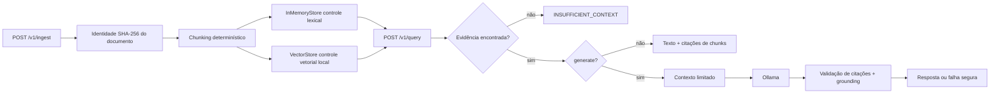
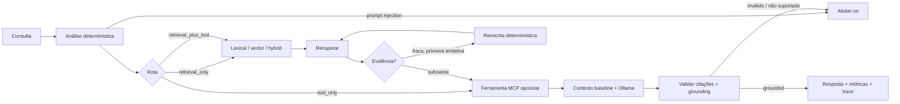

# Production Agentic RAG

**Uma implementação prática para construir e avaliar aplicações de IA que respondem perguntas utilizando informações recuperadas de documentos.**

[English README](README.md) · [Documentação técnica](docs/TECHNICAL.md) · [Repositório](https://github.com/hectordufau/productionagentrag) · [Release v1.0.0](https://github.com/hectordufau/productionagentrag/releases/tag/v1.0.0)

## Por que este projeto existe

LLMs podem produzir respostas convincentes sem possuir as informações necessárias para sustentá-las. RAG reduz esse risco ao recuperar evidências antes da geração. Este projeto investiga uma pergunta prática: **adicionar um agente torna um sistema RAG melhor?**

O repositório mantém um Baseline RAG previsível ao lado de um Agentic RAG limitado por regras para que a diferença seja medida, não presumida. Os resultados registram ganhos e regressões.

## Como funciona

Para uma pergunta como *Where are vectors stored?*, o sistema ingere documentos, recupera chunks relevantes, monta um contexto limitado, pode gerar uma resposta local via Ollama e valida grounding e citações. Quando a evidência é insuficiente, retorna `INSUFFICIENT_CONTEXT` em vez de chutar.

O modo agentic acrescenta seleção controlada de estratégia, avaliação de evidência, no máximo uma reescrita conservadora dentro do limite de duas tentativas e consulta opcional de metadados via MCP. É um fluxo de decisões controladas, não planejamento autônomo irrestrito.

## Principais capacidades

| Capacidade | O que faz |
|---|---|
| Recuperação lexical | Encontra chunks por palavras correspondentes. |
| Recuperação semântica | Encontra chunks por significado com `all-MiniLM-L6-v2`. |
| Recuperação híbrida | Combina rankings lexical e vetorial com RRF. |
| Reranking | Reordena candidatos com reranker local transparente. |
| LangGraph | Orquestra decisões limitadas do Agentic RAG. |
| MCP | Expõe uma ferramenta allowlisted de metadados. |
| Ollama | Executa localmente o LLM grounded `qwen2.5:3b`. |
| Qdrant | Oferece armazenamento vetorial persistente opcional. |
| Grounding e citações | Verifica suporte nos chunks enviados ao modelo. |
| Avaliação | Compara Baseline e Agentic em datasets congelados. |
| Observabilidade | Registra traces, decisões, tentativas, latência e ferramentas. |

Uma implementação de referência, independente de provedor, para construir e avaliar um serviço RAG fundamentado, partindo de um baseline pequeno até um agente LangGraph limitado por regras claras. O repositório mantém explícito o caminho baseline: ingestão e recuperação determinísticas, tratamento de evidência com falha segura, geração local via Ollama, validação de citações e grounding, além de um grafo agentic opcional com rastros de decisão.

O projeto é uma referência de engenharia, não um serviço hospedado nem uma alegação de superioridade de modelo. Cada resultado abaixo está ligado ao código, aos datasets ou aos artefatos versionados.

- **Baseline RAG:** ingestão → chunking determinístico → recuperação lexical/vetorial/híbrida → contexto limitado → geração opcional → validação de citações/grounding.
- **LangGraph agentic:** análise e roteamento determinísticos, reescrita/repetição limitada, consulta opcional a metadados via MCP em processo, geração baseline, validação, métricas e rastros de decisão por nó.
- **Local-first:** Ollama em `http://127.0.0.1:11434`, com o modelo configurado `qwen2.5:3b`.
- **Limite MCP:** SDK Python oficial `mcp==2.3.0`; uma ferramenta permitida de metadados que nunca retorna o conteúdo dos documentos.

## Navegação

- [Início rápido](#início-rápido)
- [O que está implementado](#o-que-está-implementado)
- [Arquitetura](#arquitetura-1)
- [Baseline vs. agentic](#baseline-vs-agentic-1)
- [Evidências e benchmarks](#evidências-e-benchmarks)
- [Avaliação de geração v1](#avaliação-de-geração-v1)
- [Limites de segurança e falha](#limites-de-segurança-e-falha)
- [API](#api-1)
- [Stack técnico](#stack-técnico)
- [Mapa do repositório](#mapa-do-repositório)
- [Testes e reprodutibilidade](#testes-e-reprodutibilidade)
- [Limitações e roadmap](#limitações-e-roadmap)
- [English](#production-agentic-rag)

## Início rápido

Requisito: Python `>=3.12`. A API padrão usa explicitamente o controle determinístico/em memória (`RETRIEVAL_BACKEND=memory`, `EMBEDDING_PROVIDER=deterministic`). A integração de produção é opt-in: `RETRIEVAL_BACKEND=qdrant` com `EMBEDDING_PROVIDER=sentence-transformers` usa Qdrant persistente e `all-MiniLM-L6-v2` (384 dimensões).

```bash
python -m pip install -e '.[dev]'
uvicorn agentic_rag.api.app:app --reload
```

Em outro terminal:

```bash
curl http://localhost:8000/health

curl -X POST http://localhost:8000/v1/ingest \\
  -H 'content-type: application/json' \\
  -d '{"source":"demo","filename":"notes.txt","content":"Qdrant stores vectors."}'

curl -X POST http://localhost:8000/v1/query \\
  -H 'content-type: application/json' \\
  -d '{"query":"where are vectors stored"}'
```

A consulta padrão usa recuperação lexical baseline com `generate:false`. Com evidência, retorna o texto recuperado e citações dos chunks; sem evidência, retorna `INSUFFICIENT_CONTEXT` e não chama um LLM.

Para geração local, baixe o modelo padrão verificado, disponibilize o Ollama e peça a geração explicitamente:

```bash
ollama pull qwen2.5:3b
ollama list
curl -X POST http://localhost:8000/v1/query \\
  -H 'content-type: application/json' \\
  -d '{"query":"Where are vectors stored?","retrieval":"hybrid","generate":true}'
```

O default da aplicação foi verificado em `src/agentic_rag/api/app.py` como `qwen2.5:3b` e `http://127.0.0.1:11434`. As requisições Ollama definem explicitamente `num_ctx=2048`, `num_predict=256`, temperatura `0` e `think=false`. Use `OLLAMA_MODEL`/`OLLAMA_URL` para substituir; nenhuma resposta falsa é usada quando o Ollama está indisponível.

Configuração Compose de produção (volume persistente do Qdrant; o controle determinístico continua explícito):

```bash
RETRIEVAL_BACKEND=qdrant EMBEDDING_PROVIDER=sentence-transformers docker compose up --build
```

Variáveis úteis: `RETRIEVAL_BACKEND`, `EMBEDDING_PROVIDER`, `EMBEDDING_MODEL`, `QDRANT_URL`, `QDRANT_COLLECTION`, `OLLAMA_URL`, `OLLAMA_MODEL` e `MCP_ENABLED`. `/ready` verifica o Qdrant quando o backend Qdrant é selecionado.

## O que está implementado

### Baseline RAG

- A identidade de `Document` é um checksum SHA-256 imutável do conteúdo.
- O chunking é determinístico e preserva a identidade do documento, source, filename e metadados.
- `InMemoryStore` é o controle lexical M1.
- `DeterministicHashEmbedding` com `VectorStore` é o controle vetorial local de dimensão fixa.
- A recuperação híbrida usa fusão explícita de ranking recíproco, `1/(60 + rank)`.
- `DeterministicOverlapReranker` é um controle de reranking local e transparente.
- `QdrantClient` é um adaptador HTTP opcional, usando apenas a biblioteca padrão; ele não faz fallback silencioso.
- A resposta expõe campos de recuperação, geração, grounding, latência, citações e `trace_id`.

### LangGraph agentic

O modo agentic é ativado com `"mode":"agentic"` em `POST /v1/query`; sem esse campo, o baseline continua sendo o padrão. O grafo é tipado e limitado:

1. **Analisar:** normalizar a consulta, detectar padrões de prompt injection e escolher lexical, vector ou hybrid por regras determinísticas.
2. **Roteirizar:** selecionar `retrieval_only`, `tool_only` ou `retrieval_plus_tool` quando houver identificador de documento e intenção de metadados/source.
3. **Recuperar:** reutilizar os stores e o serviço de recuperação existentes.
4. **Avaliar:** pontuar a evidência disponível.
5. **Reescrever:** fazer no máximo uma nova tentativa, dentro do limite de duas tentativas do grafo.
6. **Gerar:** reutilizar o context builder baseline e o provedor Ollama.
7. **Validar ou abster-se:** verificar grounding e citações e retornar resposta ou status de falha segura.

A resposta agentic adiciona `metrics` e `decision_trace`. Os rastros contêm nomes dos nós, tentativas, estratégia escolhida, pontuações de evidência, roteamento, reescritas, status da ferramenta, validação e erros quando aplicável. Prompts e detalhes internos brutos do provedor não são retornados.

### Ferramenta MCP de metadados em processo

O repositório usa o SDK Python oficial MCP `mcp==2.3.0`. O servidor standalone é `agentic_rag.mcp.server`; sua única ferramenta exposta é `get_document_metadata(document_id)`. Ela usa o `InMemoryStore` existente, retorna apenas metadados permitidos e nunca retorna conteúdo de documento.

`MCPToolClient` é um limite de política com falha segura: validação exata dos argumentos, allowlist, máximo de duas chamadas, timeout e erros `MCPToolError` explícitos. A saída da ferramenta é dado não confiável e não entra no prompt de geração. O grafo aceita um `MCPToolClient` opcional; o grafo padrão da API não ativa um cliente de ferramenta silenciosamente, portanto as rotas de ferramenta exigem wiring explícito.

## Arquitetura

### Pipeline baseline



A API aceita `lexical` (padrão), `vector`, `hybrid` e `hybrid+reranking`. Qdrant é separado dos controles padrão em memória e é verificado em `/v1/retrieval/qdrant-health`; quando indisponível, Qdrant retorna HTTP `503`.

### Pipeline agentic



O grafo nunca trata documentos recuperados ou metadados como instruções. A reescrita é determinística, não um loop de planejamento por LLM; geração é o único nó do grafo que chama o provedor configurado.

## Baseline vs. agentic

| Aspecto | Baseline | LangGraph agentic |
|---|---|---|
| Padrão | Sim | Opt-in com `mode=agentic` |
| Análise de consulta | Parâmetros diretos da requisição | Normalização determinística, detecção de risco e escolha de estratégia |
| Recuperação | Lexical, vector, hybrid, hybrid+reranking | Reutiliza os mesmos componentes |
| Repetição | Nenhuma no endpoint baseline | Uma reescrita determinística, no máximo duas tentativas |
| MCP | Não usado | Limite opcional de metadados em processo |
| Geração | Chamada Ollama opcional | Reutiliza o serviço de geração baseline |
| Resultado seguro | `INSUFFICIENT_CONTEXT` ou erro do provedor | Abstenção, erro de provedor/MCP ou resposta validada |
| Observabilidade | `trace_id`, latência, campos de retrieval/generation/grounding | Adiciona `decision_trace` por nó e `metrics` |
| Afirmação sustentada pelo repositório | Controle de compatibilidade estável | Roteamento limitado e comportamento rastreável, não planejamento autônomo geral |

## Evidências e benchmarks

### Benchmark de recuperação

O artefato M2A.1-R2 versionado usa o dataset congelado de 40 casos `datasets/m2a-retrieval-v2.json`, `sentence-transformers/all-MiniLM-L6-v2`, CPU, 384 dimensões, distância cosseno, cinco execuções medidas mais uma de aquecimento, candidate `k=10`, final `k=5` e RRF `k=60`.

Para a estratégia hybrid semantic RRF, o artefato registra:

| Métrica | Resultado global |
|---|---:|
| Hit rate | 0.900 |
| Recall | 0.891667 |
| MRR | 0.833333 |
| nDCG | 0.836357 |
| Latência média | 15.449804 ms |
| Latência p50 / p95 | 13.250434 / 26.370232 ms |

O resultado hybrid semantic RRF com reranking deterministic-overlap também está em `artifacts/benchmarks/latest.json`; são medições locais, não estimativas de capacidade de produção. Consultas negativas são medidas explicitamente e têm hit rate zero no artefato. O benchmark é evidência para esse dataset e configuração congelados, não uma alegação geral de qualidade semântica.

O controle offline anterior de oito casos continua reproduzível por `datasets/m2a-retrieval-v1.json` e `make benchmark-retrieval`; o artefato registra commit, dataset, provedor, configuração, tempos e métricas.

## Avaliação de geração v1

`datasets/generation-eval-v1.json` contém quatro casos: dois respondíveis e dois não respondíveis. O artefato real versionado compara `hybrid+llm` e `vector-semantic+llm` usando o modelo Ollama `aratan/Agents-A1-4B-Q4_K_M-GGUF:Q4_K_M`.

| Estratégia | Answer correctness | Groundedness | Citation correctness | Abstention correctness | Latência total média |
|---|---:|---:|---:|---:|---:|
| Hybrid + LLM | 0.25 | 0.50 | 1.00 | 1.00 | 28.670,68 ms |
| Vector Semantic + LLM | 0.25 | 0.50 | 1.00 | 1.00 | 29.598,93 ms |

A execução completou os quatro casos nas duas estratégias. É validação do pipeline, não benchmark estatisticamente significativo: quatro casos não estabelecem superioridade, a saída do Ollama depende do modelo, grounding lexical é um sinal prático e não uma prova, e o desafiante semântico requer o ambiente CPU opcional de sentence-transformers.

Reproduza a avaliação histórica v1 com:

```bash
PYTHONPATH=src .venv-semantic-cpu/bin/python scripts/run_generation_evaluation.py
```

### Avaliação de geração v2: Baseline RAG vs Agentic RAG

A avaliação final de 30 casos está congelada em `datasets/generation-eval-v2.json` (casos diretos, paráfrases, ambíguos, multi-chunk, terminologia, contexto insuficiente, metadata/tool, retrieval+MCP e injeção indireta). Os dois braços usam o mesmo corpus e casos, pontuação determinística de fatos/fontes/abstenção e SHA-256 do corpus `055d5a170e0b9862fd842c914558c3c2d3d204d31c96e2e935435a85a75bd885`. Ambos usam Ollama `qwen2.5:3b`, timeout de 120s, `num_ctx=2048`, `num_predict=256`, temperatura `0` e `think=false`; não há juiz LLM único.

| Estratégia | Qualidade | Recall de fatos | Precisão / recall de fonte | Precisão de abstenção | Latência média | Chamadas LLM | Chamadas MCP |
|---|---:|---:|---:|---:|---:|---:|---:|
| Baseline (n=30) | 0.208333 | 0.250000 | 0.200000 / 0.200000 | 0.266667 | 8.286,843 ms | 30 | 0 |
| Agentic (n=30) | 0.238333 | 0.310000 | 0.200000 / 0.200000 | 0.233333 | 7.921,985 ms | 26 | 4 |

O roteamento agentic selecionou lexical 19 vezes, vector 4 vezes e hybrid 7 vezes. Os percentuais de retry e rewrite foram ambos 0% nesta execução limitada (`max_attempts=1` no braço comparável final); MCP foi usado em 13,333% dos casos. Não ocorreram erros do provedor. O braço agentic aumentou o recall de fatos em 0.060000 e a qualidade em 0.030000, mas teve precisão de abstenção 0.033334 menor. Os resultados são específicos do corpus e modelo: demonstram roteamento e ferramenta limitados, não superioridade geral. A geração é limitada pela CPU, pela recuperação e pelo comportamento de citações do modelo.

Execute com:

```bash
PYTHONPATH=src .venv-semantic-cpu/bin/python scripts/run_baseline_vs_agentic_evaluation.py
```

Na versão 1.1, o dataset/corpus congelado é preservado e a comparação detalhada por caso é gravada em `artifacts/benchmarks/baseline-vs-agentic-v1.1.json`, incluindo os valores anteriores da v2 e regressões explícitas. O caminho de grounding agora infere e acrescenta citações de chunks somente quando cada frase tem pelo menos dois tokens não triviais sustentados por um chunk enviado. Respostas sem suporte continuam em falha segura.

Execute o smoke de integração real com:

```bash
PYTHONPATH=src .venv-semantic-cpu/bin/python scripts/run_integration_smoke.py
```

O smoke exige Qdrant em `127.0.0.1:6333`, SentenceTransformers `all-MiniLM-L6-v2`, Ollama `qwen2.5:3b` e MCP. O smoke v1.1 foi concluído contra Qdrant, SentenceTransformers, Ollama e MCP reais. Os IDs dos pontos no Qdrant usam UUIDs estáveis, enquanto os IDs legíveis dos chunks permanecem no payload; o script não faz fallback para o armazenamento determinístico.

## Limites de segurança e falha

- Documentos recuperados e metadados MCP são dados não confiáveis; não são instruções, código executável, controle do grafo ou política de recuperação.
- O prompt grounded separa evidência de instruções. Padrões de prompt injection são detectados deterministicamente no modo agentic e causam abstenção.
- O cliente MCP expõe apenas `get_document_metadata`, valida argumentos, limita chamadas a duas, aplica timeout e falha com segurança em erros de transporte, ferramenta ou saída.
- Metadados não entram no contexto de geração. Respostas sobre source mantêm citações de chunks e podem adicionar provenance identificável da ferramenta quando o cliente opcional está conectado.
- Ausência de evidência produz `INSUFFICIENT_CONTEXT`; citações não suportadas e grounding não suportado não viram respostas confiantes.
- Timeout, indisponibilidade e falhas do Ollama são erros explícitos; não há resposta fake de fallback.
- O conteúdo é identificado por SHA-256, mas os stores padrão são em memória e não constituem controle de acesso. Não há camada de credenciais, autenticação, autorização ou gestão de segredos.

## API

### `POST /v1/ingest`

Schema da requisição:

```json
{
  "source": "demo",
  "filename": "notes.txt",
  "mime_type": "text/plain",
  "content": "Qdrant stores vectors.",
  "metadata": {"topic": "storage"}
}
```

`source`, `filename` e `content` são obrigatórios; `mime_type` tem default `text/plain` e `metadata` tem default `{}`. A resposta é:

```json
{"document_id":"<sha256>","duplicate":false,"chunks":1}
```

Conteúdo duplicado retorna o mesmo `document_id`, `duplicate:true` e `chunks:0`.

### `POST /v1/query`

Schema da requisição:

```json
{
  "query": "Where are vectors stored?",
  "limit": 5,
  "retrieval": "hybrid",
  "metadata_filter": null,
  "generate": true,
  "mode": "baseline",
  "context_tokens": 1800
}
```

`query` é obrigatório. `limit` é `1..50`; `retrieval` aceita `lexical`, `vector`, `hybrid` ou `hybrid+reranking`; `generate` tem default `false`; `mode` aceita `baseline` ou `agentic`; e `context_tokens` é `1..12000`, com default `1800`. Uma resposta baseline inclui `status`, `answer`, `citations`, `retrieval`, `generation`, `grounding`, `latency`, `trace_id`, `grounded` e `retrieved_chunks`. Respostas agentic incluem também `metrics` e `decision_trace`.

Os endpoints operacionais são `GET /health`, `GET /ready`, `GET /version` e `GET /v1/retrieval/qdrant-health`.

## Stack técnico

- Python `>=3.12`, FastAPI, Uvicorn, Pydantic 2
- LangGraph `>=0.6,<1` para o grafo tipado e limitado
- SDK Python oficial MCP `mcp>=2.3,<3` (o ambiente versionado usa `2.3.0`)
- Provedor HTTP local Ollama
- Controles lexicais/vetoriais em memória e Qdrant opcional `qdrant/qdrant:v1.12.5`
- `sentence-transformers>=3.0,<4` opcional, com `all-MiniLM-L6-v2` para o artefato semântico
- Pytest e Ruff

## Mapa do repositório

```text
.
├── src/agentic_rag/
│   ├── agentic/graph.py          # orquestração LangGraph limitada
│   ├── api/app.py                # schemas e endpoints FastAPI
│   ├── generation/               # provedor Ollama, contexto, grounding
│   ├── mcp/                      # servidor SDK MCP e cliente de política
│   ├── retrieval/                # lexical, vector, hybrid, reranking, Qdrant
│   ├── chunking/                 # chunking determinístico
│   └── storage/                  # documentos, chunks, store em memória
├── datasets/
│   ├── generation-eval-v1.json
│   ├── m2a-retrieval-v1.json
│   └── m2a-retrieval-v2.json
├── artifacts/benchmarks/         # evidências de benchmark versionadas
├── docs/                         # arquitetura, decisões e avaliações
├── scripts/                      # executores de benchmark e avaliação de geração
├── tests/unit/                   # testes baseline, retrieval, agentic e MCP
├── tests/integration/qdrant/     # cobertura do ciclo de vida Qdrant
├── Makefile
├── docker-compose.yml
└── pyproject.toml
```

## Testes e reprodutibilidade

Os gates locais do repositório são:

```bash
python -m pytest -q
ruff check src tests scripts
```

Targets Make existentes:

```bash
make setup
make test
make lint
make evaluate-retrieval
make benchmark-retrieval
make benchmark-semantic
make test-integration
make up
make down
```

`make test-integration` exige o serviço Qdrant. `make benchmark-semantic` exige as dependências semânticas opcionais e o ambiente do modelo. A cobertura focada de MCP/agentic é:

```bash
pytest -q tests/unit/test_mcp.py tests/unit/test_agentic.py
```

Os artefatos versionados preservam caminhos e checksums dos datasets, metadados de modelo/provedor, configuração, tempos e fatos selecionados do ambiente. Uma nova execução do Ollama ou do benchmark semântico pode variar conforme hardware, disponibilidade do modelo, versões das dependências e estado dos serviços locais.

## Limitações e roadmap

As limitações atuais são intencionais: a recuperação padrão usa vetores hash determinísticos em vez de encoder aprendido; a avaliação semântica é opcional e orientada a CPU; os stores são em memória; Qdrant é um adaptador opcional; a saída do Ollama depende do modelo; grounding é verificação lexical de evidência; e não há autenticação, autorização, persistência, memória, plataforma de deploy, backend de observabilidade, provedor comercial ou benchmark estatístico de geração. O grafo padrão da API também exige wiring explícito do cliente MCP para chamadas de ferramenta.

A direção do roadmap é preservar o controle baseline enquanto adiciona melhorias apoiadas por evidência: datasets de avaliação mais amplos, avaliações mais fortes de recuperação e grounding, persistência e observabilidade operacionais explícitas e integrações cuidadosamente limitadas. O repositório não afirma possuir essas capacidades futuras hoje.
