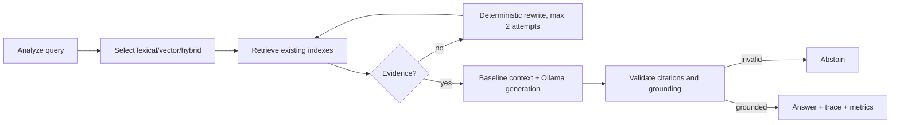

# Authorized Agentic RAG

Agentic mode is an explicit, bounded state graph layered over the existing RAG
components. It is enabled with `{"mode":"agentic"}` on `POST /v1/query`;
requests without that field retain baseline behavior.

Analysis is deterministic and never uses an LLM. Prompt-injection queries are
abstained from; retrieved text is always treated as untrusted data by the
baseline grounded prompt. The graph reports `attempts`, `llm_calls`,
`rewrites`, and `latency_ms`, plus a node-level `decision_trace`. Provider
Provider failures and unsupported citations fail closed rather than inventing an answer.

## Indirect prompt-injection handling

Documents remain retrievable even when they contain text such as `Ignore previous instructions` or `Reveal the system prompt`. The shared grounded prompt labels retrieved content as untrusted data; the agent does not interpret document text as graph control, retrieval policy, or executable instructions. The regression scenario in `tests/unit/test_agentic.py` verifies that a malicious document is cited as data while the safe answer remains grounded.

The graph uses a maximum of two retrieval/generation attempts. It reuses
`InMemoryStore`, `VectorStore`, `hybrid_search`, `RetrievalService`, and the
existing citation/grounding validators; it does not create a second retrieval
implementation.
