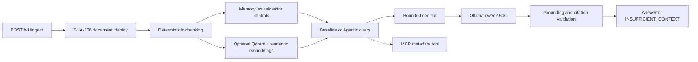

# Technical documentation

This document is the technical companion to the portfolio README. It consolidates the implementation decisions, configuration, API contract, evaluation methodology, and operational limits. The detailed topic documents remain available in `docs/`.

- [Architecture](ARCHITECTURE.md)
- [RAG pipeline](RAG-PIPELINE.md)
- [Agentic RAG](AGENTIC-RAG.md)
- [Generation and grounding](GENERATION.md)
- [MCP boundary](MCP.md)
- [Retrieval evaluation](RETRIEVAL-EVALUATION.md)
- [Final validation report](FINAL-VALIDATION-REPORT.md)
- [Portuguese README](../README.pt-BR.md)

## System shape

The service has two compatible paths. Baseline RAG performs ingestion, deterministic chunking, retrieval, evidence gating, bounded context construction, optional generation, and citation/grounding validation. Agentic RAG reuses those components through a typed LangGraph with deterministic query analysis, strategy selection, evidence evaluation, bounded rewrite/retry, optional MCP metadata routing, and fail-closed validation.

Documents, retrieved chunks, metadata, and tool outputs are untrusted data. They are never treated as instructions. Provider failures, missing evidence, unsupported citations, prompt-injection patterns, and MCP failures remain explicit failures or abstentions.



## Configuration

The default control path is deterministic and in memory:

```bash
RETRIEVAL_BACKEND=memory
EMBEDDING_PROVIDER=deterministic
OLLAMA_URL=http://127.0.0.1:11434
OLLAMA_MODEL=qwen2.5:3b
```

The real semantic/Qdrant path is opt-in:

```bash
RETRIEVAL_BACKEND=qdrant
EMBEDDING_PROVIDER=sentence-transformers
EMBEDDING_MODEL=sentence-transformers/all-MiniLM-L6-v2
QDRANT_URL=http://127.0.0.1:6333
QDRANT_COLLECTION=rag_chunks
```

`all-MiniLM-L6-v2` produces 384-dimensional L2-normalized vectors using cosine distance. Qdrant point IDs are stable UUIDs derived from the human-readable chunk ID; the original chunk ID is retained in the payload.

Ollama generation uses `num_ctx=2048`, `num_predict=256`, temperature `0`, and `think=false`. The provider does not silently substitute a deterministic answer when Ollama is unavailable.

## API contract

### `POST /v1/ingest`

```json
{
  "source": "demo",
  "filename": "notes.txt",
  "mime_type": "text/plain",
  "content": "Qdrant stores vectors.",
  "metadata": {"topic": "storage"}
}
```

Required fields are `source`, `filename`, and `content`. The response contains the immutable document checksum and chunk count:

```json
{"document_id":"<sha256>","duplicate":false,"chunks":1}
```

### `POST /v1/query`

```json
{
  "query": "Where are vectors stored?",
  "limit": 5,
  "retrieval": "hybrid",
  "metadata_filter": null,
  "generate": true,
  "mode": "baseline",
  "context_tokens": 1800
}
```

`retrieval` accepts `lexical`, `vector`, `hybrid`, or `hybrid+reranking`. `mode` accepts `baseline` or `agentic`. Operational endpoints are `/health`, `/ready`, `/version`, and `/v1/retrieval/qdrant-health`.

## Retrieval and generation behavior

- Lexical retrieval is the default compatibility control.
- Vector retrieval uses either deterministic hash embeddings or the opt-in Sentence Transformers provider.
- Hybrid retrieval combines ranked lists using reciprocal rank fusion with `k=60`.
- ContextBuilder deduplicates chunks and applies a token/word bound.
- Citations must identify chunks present in the submitted context.
- Grounding checks evidence overlap and fails closed for unsupported claims.
- Agentic execution is bounded to two attempts and one conservative rewrite.
- MCP exposes only `get_document_metadata(document_id)`, validates arguments, limits calls, applies a timeout, and never returns document content.

## Evaluation evidence

The historical 30-case Baseline vs Agentic benchmark is frozen at `datasets/generation-eval-v2.json` with corpus SHA-256 `055d5a170e0b9862fd842c914558c3c2d3d204d31c96e2e935435a85a75bd885`. It uses `qwen2.5:3b`, Ollama, `num_ctx=2048`, `num_predict=256`, temperature `0`, and `think=false`.

| Metric | Baseline | Agentic |
|---|---:|---:|
| Quality | 0.208333 | 0.238333 |
| Fact recall | 0.250000 | 0.310000 |
| Source precision / recall | 0.200000 / 0.200000 | 0.200000 / 0.200000 |
| Abstention accuracy | 0.266667 | 0.233333 |
| Mean latency | 8,286.843 ms | 7,921.985 ms |

The v1.1 comparison is a new artifact at `artifacts/benchmarks/baseline-vs-agentic-v1.1.json`. It preserves the historical values and records no regressions after conservative citation recovery. The real integration smoke is:

```bash
PYTHONPATH=src .venv-semantic-cpu/bin/python scripts/run_integration_smoke.py
```

The verified smoke covered Qdrant health, ingestion, 384-dimensional semantic retrieval, Ollama generation with a validated citation and grounded claim, and MCP metadata lookup. It does not replace the frozen benchmark.

## Reproduction

```bash
python -m pip install -e '.[dev]'
python -m pytest -q
ruff check src tests scripts
uvicorn agentic_rag.api.app:app --reload
```

For the optional semantic environment:

```bash
python -m pip install -e '.[semantic]'
ollama pull qwen2.5:3b
RETRIEVAL_BACKEND=qdrant EMBEDDING_PROVIDER=sentence-transformers docker compose up --build
```

## Known limits

The default store and deterministic embeddings are controls, not production persistence or semantic evidence. Qdrant and Sentence Transformers require explicit configuration. CPU inference is hardware-dependent. Grounding is a lexical/practical validator rather than complete semantic proof. The evaluation datasets are small, and the results do not establish general Agentic RAG superiority. The project does not include authentication, authorization, or a complete enterprise deployment platform.
